# Noisy GIF Player

## What is it?

It's a little portable device with a tiny screen and speaker to play animated GIFs, along with sound, from a microSD card.

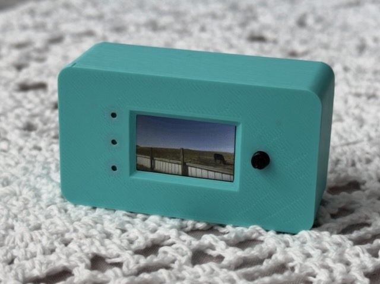
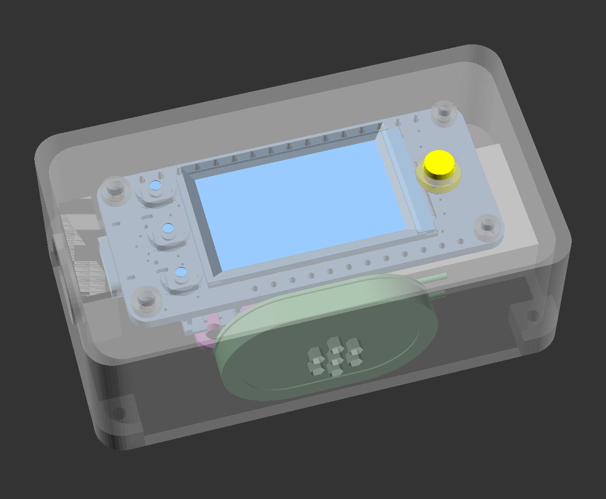

## How do I build one?

### Step 1: Buy parts

You need these parts:

* [Adafruit ESP32-S3 Reverse TFT Feather](https://www.adafruit.com/product/5691)
* [Adafruit SDIO breakout](https://www.adafruit.com/product/4682)
* [Adafruit I2S MAX98357A breakout](https://www.adafruit.com/product/3006)
* [Mini oval speaker](https://www.adafruit.com/product/3923)
* [Female headers for Feathers](https://www.adafruit.com/product/2886)
* [Solid core hookup wire](https://www.adafruit.com/product/1311)
* [400mAH battery for Feathers](https://www.adafruit.com/product/3898)
* Some screws:
  * 2&times; M2.5x4 screws
  * 2&times; M2x4 screws
  * 4&times; [countersunk self-tapping M2x6 screws](https://www.amazon.com/dp/B09DB5SMCZ?th=1)
* A microSD card

You'll also need a 3D printer, soldering iron, tiny screwdriver, paperclip, and USB C cable.

### Step 2: Print the enclosure

Print the following parts. Use 0.2mm layer height and any infill you desire. The STLs are in the latest release download on GitHub.

* Print `Case.stl` with the screen opening on the print bed. Use paint-on supports for the four screw holes in the corners of the case. You can do the same for the USB C port, but if your printer bridges well, you should be fine without them.
* Print `Backplate.stl` with the two ribs facing upwards.
* Print `Button.stl` with the wider part of the button on the print bed.

### Step 3: Make at least GIF

The code assumes at least one GIF is loaded onto the SD card, so make one. These instructions assume macOS or Linux. You'll need to adapt the instructions or the code for Windows.

The repository includes a script called `convert.sh` that runs FFmpeg with very specific arguments to make GIFs and WAVs compatible with the board. Install FFmpeg before continuing. You'll need a computer with a microSD card reader.

1. Download a video, GIF, or anything else of your choosing to your computer.
2. Open a terminal and `cd` to the project's directory.
3. Run `chmod +x convert.sh` to make the conversion script executable.
4. Assuming your source file is called `test.mp4`, run `convert.sh test.mp4`. This will output in the same location `test.gif` and `test.wav`.
5. Format your SD card as FAT32. Create two directories in the root: `gifs` and `wavs`. Copy `test.gif` to `gifs/` and `test.wav` to `wavs/`.

### Step 4: Physical assembly

Read through these instructions first before actually starting them. Everything is a very tight fit in the enclosure and the details matter.

Here's a logical diagram of how the components are connected, for reference. In particular, note the following:

* The Feather's `GND` pin is shared, but two separate `3V` pins are used
* The SD breakout aligns to the _second_ 3V pin through `SCK`
* The I2S amplifier aligns to `MI` through `TX`
* `RST`, `MO`, and `DB` are unused on the row of 16 pins
* None of the pins on the row of 12 pins are used

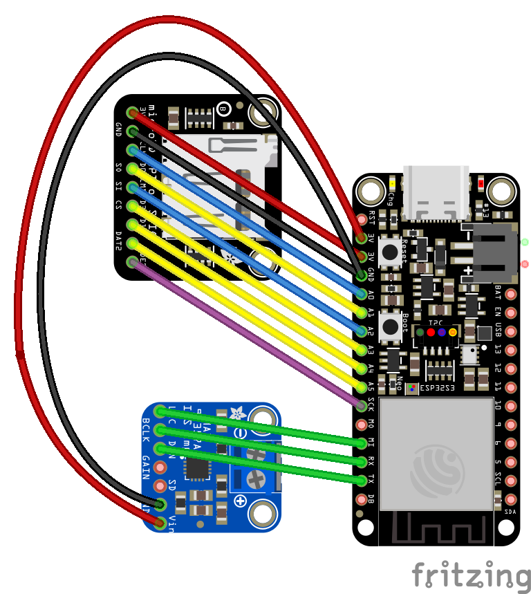

When soldering the male headers, you may have rows of headers that have more pins than you need, but getting the number of pins correct is essential. You can twist apart the headers to break them into the necessary size.

1. Solder headers to various boards. Be sure you get the pins right! You will not use all the headers!
   1. Solder the 16-pin female header to the Feather's row of 16 pins (`RST` through `DB`). **Do not solder the 12-pin female header.** The female portion of the header is on the opposite of the board as the LCD, like this:
   
      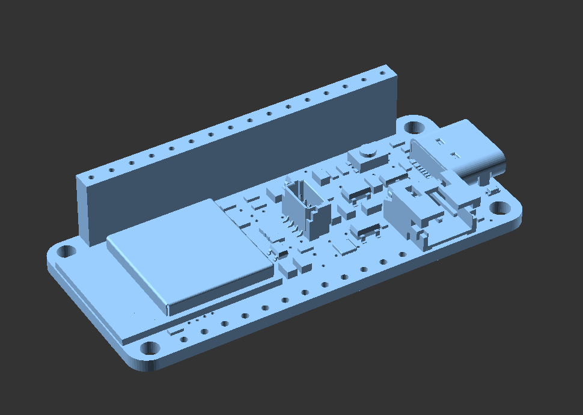
      
   2. Solder a male header to the SD card breakout. The SD card slot faces up and the male header faces down, like this:
   
      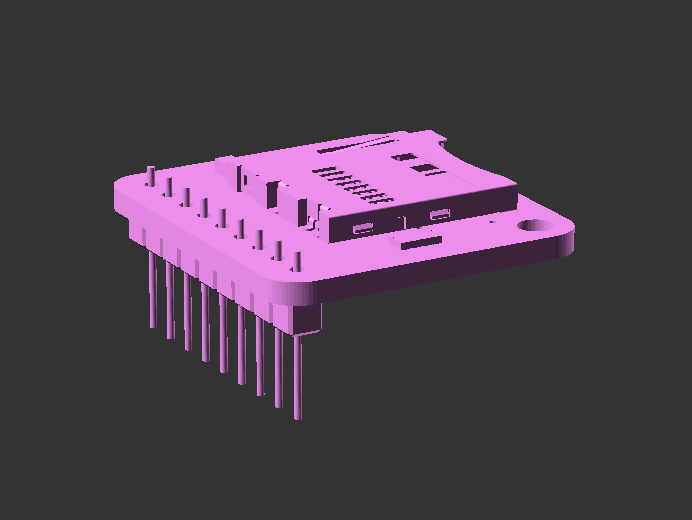

   3. Solder a male header **with only three** pins to the I2S amplifier breakout. Solder the `LRC`, `BCLK`, and `DIN` pins like this. Note that in this picture, the screw terminals if included with your board aren't shown, but would be on the top with the headers facing down. The components are also on the top.

      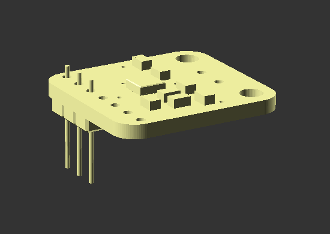

2. If your I2S amplifier came with presoldered screw terminals, you'll need to remove them because they take up too much space. Gently twist and rock them back and forth a whole bunch until you can work them free, or if you're able, desolder the pins. This might take a while; be patient to avoid breaking the board.

3. Now you'll connect the speaker to the I2S amplifier.

   1. Cut the tiny male JST connector off the speaker. You'll need every bit of wire possible, so cut off the connector as close to the wires as possible.
   2. Strip about 3 mm from the red and black wires from the speaker. The wire is very thin and you won't have much to work with, so be careful!
   3. Solder the black wire to the `-` pin on the I2S amplifier. This is one of the pins that are now exposed after you removed the screw terminals.
   4. Solder the red wire to the `+` pin.

4. Lastly, you need to solder a couple wires to the I2S amplifier for power and ground. This isn't necessary for the SD breakout because the pins already line up. Once you're done, the `GAIN` and `SD` pins should be unoccupied, but the other pins all connected to either headers or wires.

   1. Cut a black wire about 5 cm long and strip both ends at about 3 mm. Solder one end to the `GND` pin on the I2S amplifier. Solder the other end to the `GND` pin on the SD breakout. This means that the `GND` pin on the SD breakout will be soldered to both a male header pin and the wire, so it'll be tricky to solder.
   2. Cut a red wire about 5 cm long. Strip one end to 3 mm, and the other to about 6 mm. Solder the 3mm end to the `VIN` pin of the I2S amplifier. Leave the other end free for now.

5. Finally it's time to put everything in the enclosure.

   1. Place the tiny 3D printed button in its hole. The narrow end goes through the front of the case. The wider part keeps it in place, like this:

      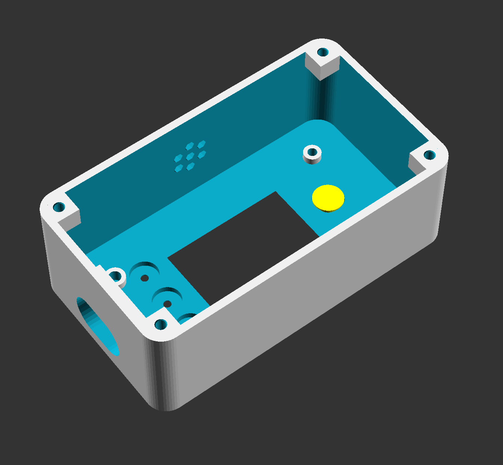

   2. Connect the battery to the Feather. Definitely from this point onwards be careful aligning things and poking around with screwdrivers so you don't short any components!
   
   3. Screw the Feather into place. Use the M2.5x4mm screws for the larger holes and M2x4mm screws for the smaller ones. Only tighten them enough to keep the board in place. Overtightening will easily strip the plastic and you'll need to reprint the case. Once done, test pressing the button to make sure it moves freely and actuates the reset button on the Feather itself.

      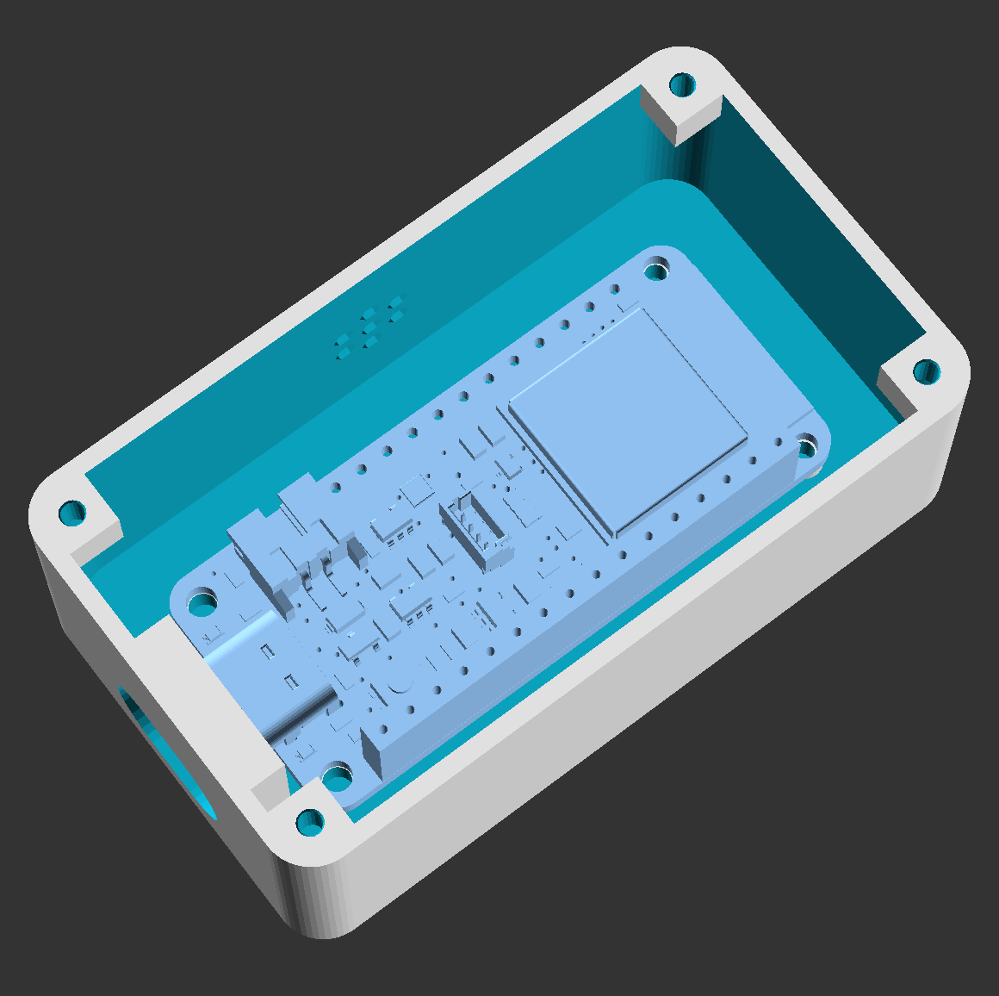

   4. Insert your microSD card into the SD reader, then install the SD reader and I2S amplifier. Note the alignment. **Be sure to align them to the pins shown!** The first two pins closest to the USB C port should be empty, along with the last pin closest to the ESP32. When doing so, tuck the battery under the breakouts (the white box).

      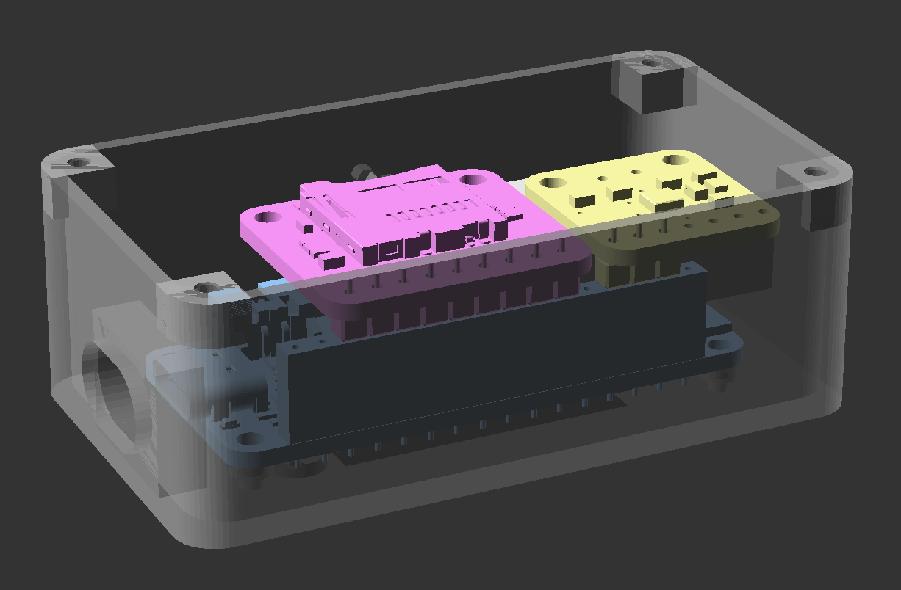
      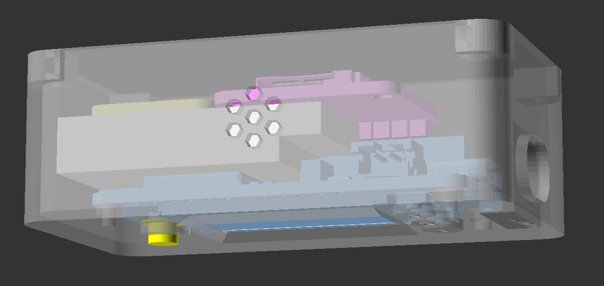

   5. Take the loose end of the red wire and put it in the second pin closest to the USB C port (`3V`) of the female header.

   6. Remove the white cover for the adhesive on the sticker, and shove it into place by the speaker hole with the grille facing outwards. It may be tricky to maneuver it around the battery connection.

      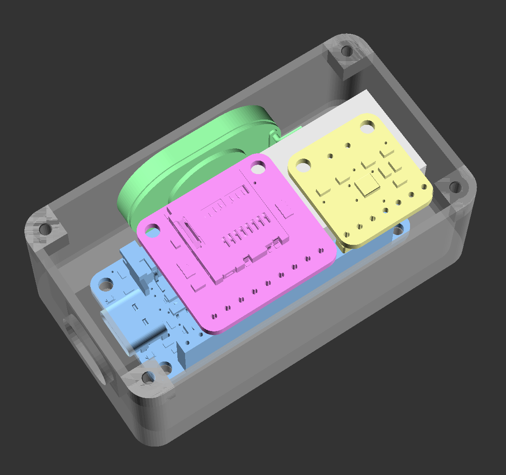

6. You're done! Screw the backplate on with the ribs facing inward by the components using the self-tapping screws.

### Step 5: Software installation

These instructions assume you have basic experience with the Arduino IDE.

1. Install the Arduino IDE and set it up for this board per [Adafruit's instructions](https://learn.adafruit.com/esp32-s3-reverse-tft-feather/arduino-ide-setup-2).
2. Open `software/Arduino/Arduino.ino` and install the following libraries:
   1. "SD" by Adafruit
   2. "Adafruit GFX Library" by Adafruit
   3. "Adafruit ST7735 and ST7789 Library" by Adafruit
   4. "AnimatedGIF" by Larry Bank
3. Connect the board to your computer via a USB C cable.
4. Using a paperclip, press and hold D0. While holding D0, press the Reset button, then release D0. When holding the board with the 3D printed button to the right of the screen, D0 is the top-left pinhole for a paperclip.
5. Connect to the board in the Arduino IDE.
6. Compile and upload the sketch. Once uploaded, press the Reset button; this board doesn't auto-reset on upload in certain circumstances.

Press the Reset button. Your GIF should play, along with sound! Once the GIF is done, the board sleeps. Pressing the button resets it and plays the GIF again.

## Usage

The physical 3D printed button presses the Reset button on the Feather. This will do one of several things:

* If the board is off (sleeping), it will wake up and start playing a GIF.
* If a GIF is already playing, it will reset the board and play a GIF.
* It will enter USB mode to load files without the need to access the microSD card physically (see below).

The battery should last a long time, but it's not a good idea to let it discharge too deeply. Charge the board with a USB C cable periodically.

If you press the reset button twice quickly, it might enter a USB bootloader mode that's built into the board. Don't use this mode; just press Reset once again to resume normal operation.

### Creating GIFs

Use `convert.sh` as described above to create GIFs. If a GIF has a corresponding WAV, then both play. If there is no corresponding WAV, then the GIF will play silently; that is, the WAV for a given GIF is optional.

`convert.sh` does several things:

* Forces the FPS to 15 by default
* Forces the resolution to exactly 240x135, which is the native resolution of the screen. GIFs are letterboxed or pillarboxed as necessary to keep the aspect ratio and to match this resolution.
* Forces a specific color palette
* Outputs a WAV file at 16 KHz mono

Don't use GIFs or WAVs you find on the internet because they will not likely be compatible with these specs. Always process all your files through `convert.sh`, even if the source itself is a GIF, to be sure it's compatible with the project.

### Loading more GIFs

There are two ways to load a GIF and WAV.

The fastest way for a lot of GIFs and WAVs is directly via the microSD card, but this requires partially disassembling the project to get the card out. This is inconvenient, but file transfers are much faster.

The more convenient way is by a USB cable, but it's much slower. To do this:

* Use a paperclip to hold down the D2 button. When viewed with the reset button on the right, this is the bottom-left pinhole.
* While holding down D2, press reset, then release D2.

This reboots the board into USB loading mode, and a message on the screen states as such. A new drive will appear on your computer when connected by USB. The name will be the same as whatever the SD card was named when you formatted it. You can now manage files on the drive, but transfer speeds will be much slower vs. directly accessing the SD card through a reader.

Once you're done managing the files, eject the drive from your computer, then press the Reset button.

## Known issues

* **The OpenSCAD code is terrible and a lot of the math is wrong if you adjust some settings, like surface thickness.** Sure is. I needed to build this quickly so I hardcoded a _lot_ of things. I welcome any attempts to clean up or just completely redo the enclosure code.
* **Some of the Arduino code is also terrible.** Because it is largely and shamefully AI generated for the same reason of time constraints, plus C++ not being my speciality. At least it works.
* **Pressing the Reset button twice in a specific pattern enters some special bootloader mode.** I know; this is built into the Feather by default and I'm not sure how to disable it.
* **The USB transfer speed is super slow.** That's a limitation of the board. I don't think there's any way to make it faster. If you want to transfer a lot of data, take out the SD card and put it in a card reader.
* **If I load a lot of GIFs, some don't show up in rotation.** The code artificially limits the list of GIFs to 64, but you can increase this.
* **There's no low battery warning.** Yes I should add that. There's an onboard I2C battery monitor that should work for this purpose; I just haven't programmed that in yet.